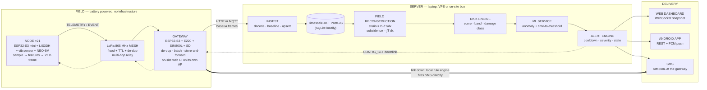

# End-to-end workflow

How one ground movement becomes a warning on somebody's phone — every hop, the
data shape at each hop, who decides what, and what happens when a hop fails.

Read this alongside `README.md` (what the system is) and
`packages/subnet-proto/subnet_proto/proto.py` / `firmware/common/mesh_proto.h`
(the wire format, in Python and in C).



The single most important property: **every stage is degradable**. Losing the
cloud does not lose the warning; losing the broker does not lose the uplink;
losing the internet does not lose the SMS.

---

## Stage 0 — Commissioning (once, per panel)

Nothing works until the system knows where the nodes are and what "undisturbed"
looks like for each one.

| Step | Who | Where |
|---|---|---|
| Panel geometry entered — depth, extraction thickness, subsidence factor, angle of draw, face position | Operator / commissioning script | `POST /api/provision` → `backend/app/api.py:264` |
| Nodes planted as a **survey line across the panel**, running a full radius of influence past each edge (tilt and strain peak over the rim; the ends are the undisturbed anchors the subsidence integral needs) | Field crew | `build_transect_field()` in `ml/simulator/field.py` |
| Spacing checked against **both** constraints — radio range and strain resolution. The sensing one binds ~3× tighter | Planning | `max_sensing_spacing_m()` vs `RadioModel.max_reliable_spacing_m()` |
| Each node's attitude **and the temperature it was taken at** recorded as its commissioning baseline | Survey, or the node's first frame | `nodes.baseline_pitch_mdeg/roll_mdeg/temp_c_x100` |
| Node addresses assigned (16-bit; `0x0001` reserved for the gateway) | Provisioning | `packages/subnet-proto/subnet_proto/proto.py:21` |

**Why baselines dominate everything downstream:** a node is hand-planted on
uneven ground, so its raw tilt mostly describes how hard the post was hammered
in. Every later reading is measured *against* that baseline
(`backend/app/risk.py:assess`). Skip this and the system fires critical alerts on
every node the moment it joins, then goes blind to the movement it exists to
detect.

A node that appears on the mesh without being provisioned is **auto-provisioned
unplaced** (`ingest.py:_node_for`) — an unknown-position node reporting real
movement is better than a silently discarded one. An operator drops its pin on
the map afterwards via `PATCH /api/nodes/{addr}`.

---

## Stage 1 — Node: sensing and on-node feature extraction

Each node runs a duty cycle, not a stream. Radio is the expensive part, so the
ESP32-S3 does the reduction locally and sends 22 bytes.

```
wake  →  sample burst  →  extract features  →  local threshold check  →  TX  →  deep sleep
                                                        │
                                                        └─ breach? EVENT frame, immediately
```

| Sensor | Measures | Reported as |
|---|---|---|
| LIS3DH accelerometer | Static tilt from the gravity vector, plus vibration energy over the sample burst | `pitch_mdeg`, `roll_mdeg` (int16), `vib_rms_mg`. `vib_peak_hz` needs a uniformly sampled FIFO burst and an FFT; the shipping firmware reports 0 rather than a number it did not measure — see the note in `firmware/node/main/main.c` |
| LIS3DH die temperature | Thermal expansion of the mounting post — **a correction channel, not weather** | `temp_c_x100` (int16, centi-°C) |
| Vibration sensor | Wired to an EXT1 wake pin: a blast or impact wakes the node out of deep sleep at zero standing current, instead of waiting for its slot | drives the `EVENT` fast path |
| NEO-6M GNSS | Position, UTC, satellite count. **Not subsidence** — metre-scale against a millimetre signal | `gnss_status` (fix + sats); full fix in a separate `POSITION` frame |
| Battery divider | Remaining life; solar keeps it topped up | `vbat_mv` |
| E220 radio | Last received link quality | `rssi`, `snr` |

Also carried: `n_samples`, how many raw samples were averaged into the frame, so
the server knows this reading's noise (σ/√n) before it differentiates the field.

**Why temperature is in the frame.** The mounting post expands. At ~18 mdeg of
apparent tilt per °C, an ordinary 15 °C day produces ~4.7 mm/m of tilt that is
not there — over five times the sensor's own noise, and systematic, so averaging
never removes it. Left uncorrected the system raises a false alarm every
afternoon, and a system that cries wolf daily gets switched off. The die
temperature is measured by the same chip that measured the tilt, at the same
instant, so subtracting it works; an ambient reading from elsewhere on site
would not correlate with this post and would correct nothing.

Everything above packs into the 22-byte `TELEMETRY` payload
(`proto.py:163`, mirrored in `firmware/common/mesh_proto.h:56`). Feature
extraction is already done on-node — the server never sees raw accelerometer
samples. That reduction is what makes a low-bitrate LoRa link sufficient for a
whole field, and it is also what lets a node spend almost all of its life
asleep.

**Two uplink paths out of a node:**

- **`TELEMETRY`** — periodic, on the duty cycle. `sample_interval_s` defaults to
  60 s and is remotely reconfigurable (`node_configs`).
- **`EVENT`** — a node-side threshold breach (`EVT_TILT_RATE`,
  `EVT_TILT_ACCEL`, `EVT_DISPLACEMENT`, `EVT_NODE_TAMPER`, `EVT_LOW_BATTERY`, …).
  **Bypasses the duty cycle entirely** — the node does not wait for its next slot. This is the fast
  path that makes the system an early-warning system rather than a logger, and
  it works even if the server is unreachable, because the gateway's own rule
  engine can act on it.

Node-side thresholds (`tilt_alert_mdeg`, `vib_alert_mg`,
`tilt_rate_alert_mdeg_h`) live in the node's config and are pushed down from the
dashboard — see Stage 9. The rate threshold is the important one: with no crack
gauge to catch a first opening, **accelerating tilt is the precursor**, and it
crosses a limit while absolute tilt is still comfortably inside its own.

Nodes carry no RTC across deep sleep, so `t_epoch` is disciplined by periodic
`TIME_SYNC` downlinks (`proto.py:364`).

---

## Stage 2 — Mesh: getting the frame home

A star topology fails on a mine site: ground-level propagation with an
overburden dump or tree belt in the way kills the far nodes. The mesh is the
differentiating claim, and it is a measured number, not a slogan — under the
modelled propagation in `ml/simulator/mesh.py`, star delivers **43%** of frames
and the mesh delivers **100%** (`ml/tests/test_mesh.py`).

| Mechanism | Field | Behaviour |
|---|---|---|
| Controlled flood | — | Each node rebroadcasts frames it has not seen |
| Hop limit | `ttl` (default 4) | Decremented per hop; dropped at 0. Covers a 15–21 node field comfortably |
| De-duplication | `src` + `seq` | Per-source counter; a node forwards a given `(src, seq)` once |
| Path length | `hops` | Incremented per hop, so the server learns the *actual* route taken |
| Integrity | `crc16` | CCITT-FALSE over header[0..9] + payload. A corrupt frame is dropped, never trusted |
| Topology | `NEIGHBOR` frames | Each node's RSSI/SNR table, sent far less often than telemetry because topology changes slowly |

Self-healing is implicit: if a relay node dies, the flood simply finds another
path, and the `hops` count in subsequent frames shows the route changed. The
dashboard's mesh graph is drawn from `NEIGHBOR` reports plus those hop counts,
so the highlighted route is the path packets actually took, not a guess
(`backend/app/state.py:_links`).

Frames the link budget genuinely loses are **not** recovered — that is
deliberate, so the packet-delivery statistic on the dashboard stays honest.

---

## Stage 3 — Gateway: the boundary between field and network

The gateway is the **same ESP32-S3 board as a node** — different modules on the
same headers, different value in NVS — with the E220, a SIM800L and a microSD
card. It is the only node with a mains or solar-plus-large-battery budget, and it
is where the system stops being a radio network and becomes a data pipeline.

Responsibilities, in order:

1. **Receive and de-duplicate** — the same frame arrives via several relay paths.
2. **Buffer to SD** — every frame is written before anything else is attempted.
3. **Batch** — up to 64 frames per uplink, base64-encoded, one HTTP POST or MQTT
   publish (`ml/simulator/virtual_gateway.py:_post`).
4. **Store-and-forward** — if the backend is unreachable, frames accumulate on SD
   and are reconciled when the link returns. The buffer is bounded the way an SD
   card is bounded; oldest frames are shed first.
5. **Run a local rule engine** — the gateway independently evaluates severity so
   that **an SMS can be sent with no internet at all**. This is the path that
   matters at 3 a.m. on a site whose backhaul is down.
6. **Relay downlinks** — `CONFIG_SET` and `TIME_SYNC` toward sleeping nodes. A
   held downlink goes out the instant that node is next heard from: a frame just
   received is proof the sender is awake, which no wake-on-radio scheme can
   better.
7. **Serve its own web UI** — one page from flash, over the site network and
   over the gateway's own access point. It answers "is this box working" for
   somebody standing next to it, including when the site network is the thing
   that is broken: scan for networks and join one without a reboot, watch every
   node it has heard, send a test SMS (`firmware/gateway/main/webui.c`).
8. **Optionally push a decoded realtime feed** — a JSON document of the gateway
   and every node, POSTed to any endpoint the operator configures, every ten
   seconds. Separate from the ingest path and allowed to fail, so a third-party
   dashboard can never delay a warning (`report.c`, `uplink_push_json`).

Two transports, both first-class:

| Transport | Endpoint | When |
|---|---|---|
| HTTP | `POST /api/ingest` with `{frames: [base64...], gateway, site}` | Default. Simplest for a constrained ESP32 with a TLS-free WiFi stack |
| MQTT | publish `subnet/gw/<id>/up`, subscribe `subnet/gw/<id>/cmd` | Deployed shape. Broker is Mosquitto (`docker-compose.yml`) |
| Realtime push | `POST <any URL>` with a decoded JSON document, every 10 s | Optional third-party feed. Never carries the system of record, and is allowed to fail |

MQTT is **optional by design** (`backend/app/mqtt.py`): losing the broker
degrades the transport, never the system — the gateway falls back to HTTP.

---

## Stage 4 — Ingest: radio bytes in, stored telemetry out

Both transports converge on one function: `ingest_frames()`
(`backend/app/ingest.py:65`). There is exactly one decode path, so a bug can't
exist on one transport and not the other.

```
raw bytes → decode() → dispatch by msg type → persist → assess risk → maybe alert → mark_dirty()
```

| Frame | What ingest does |
|---|---|
| `TELEMETRY` | Baseline-correct, score risk, upsert into `telemetry`, update `nodes.last_seen`, raise an alert if the band is high/critical |
| `EVENT` | Insert into `events`, raise an alert immediately (node already decided it was a breach) |
| `CONFIG_ACK` | Close the downlink loop — mark the `node_configs` row `applied`/`rejected`/`partial` and update `nodes.active_cfg_version` |
| `NEIGHBOR` | Insert `mesh_links` rows that feed the live topology graph |
| `POSITION` (17 B) | Self-place a node nobody surveyed; raise `Node Displaced` if a good fix puts it >15 m from where it was recorded — a collapse, or a theft |

Three decisions worth knowing:

- **Nothing trusts the radio.** A malformed frame increments `rejected` and is
  logged — never allowed to raise an exception that stops the ingest loop.
- **First frame from an unbaselined node establishes its baseline** — attitude
  and temperature both — so its tilt is zero by definition and no alert fires.
- **Duplicate timestamps upsert rather than drop.** The protocol timestamps in
  whole seconds, so two frames from one node can share a key. A relayed
  duplicate rewrites identical values (idempotent); a genuinely newer reading
  replaces the older one. Silently dropping real measurements is the worst way
  for a monitoring system to fail.

---

## Stage 5 — Storage: cloud or local, same code

| Deployment | Database | Command |
|---|---|---|
| Laptop / demo / offline site | SQLite | `make api` — nothing to install |
| Deployed (VPS **or** on-site box) | TimescaleDB + PostGIS in one image | `make up` |

The query layer is identical either way (`backend/app/state.py` uses a correlated
`max(time)` rather than a window function precisely so both dialects work); only
the hypertable DDL differs (`backend/migrations/001_schema.sql`).

"Cloud vs local" is therefore a **deployment choice, not an architecture
choice** — which matters for a mine site with no reliable backhaul, where the
whole stack can run on a box in the control room.

Tables: `sites`, `nodes`, `telemetry` (hypertable), `events`, `alerts`,
`node_configs`, `mesh_links`, `gateways`.

---

## Stage 6 — Scoring and prediction

Two layers, deliberately separated.

### 6a. Field reconstruction — what the sensors do not measure directly

`backend/app/deformation.py`. This stage exists because a node measures tilt and
nothing else mechanical. Over a subsidence trough the quantities an engineer
needs are the neighbouring derivatives of one curve:

```
subsidence   S            = ∫ T dx        ← integrate the array
tilt         T  = dS/dx                   ← measured directly
curvature    K  = dT/dx   = d²S/dx²       ← differentiate the array
horiz disp   U  = B · T                   ← scale
strain       ε  = dU/dx   = B · K         ← differentiate the array
```

So the ranger and the crack gauge were measuring quantities an *array* of tilt
sensors already contains. A single node genuinely cannot produce strain; a line
of them can. Validated against the analytic model in
`backend/tests/test_deformation.py` — correlation 0.995 for strain, subsidence
within 2%, on a 21-node transect.

Two layout rules fall out, and both are enforced rather than assumed:

| Rule | Why | If broken |
|---|---|---|
| Spacing ≤ radius of influence ÷ 3 (~71 m at 150 m depth) | A difference across a gap wider than the feature averages over the curvature instead of measuring it | Strain correlation collapses from 0.98 to 0.29. Nodes report `strainValid: false` |
| The line must be anchored a full radius of influence beyond the panel edge | The outermost node is the zero the integral is measured from, so it has to be on ground that genuinely has not moved | Every depth in the row reads low; nodes report `subsidenceValid: false` |

The spacing rule is a *sensing* constraint and it binds about three times
tighter than the radio's ~241 m. A field planned around radio range alone
delivers every frame and reconstructs nothing.

### 6b. Deterministic risk scoring — runs on every node, every batch

`backend/app/risk.py`, synchronous, no model required:

```
tilt_deg    = |(pitch, roll) − baseline − drift·ΔT|   →  deformation, not install angle or weather
tilt_rate   = Δtilt over a 6 h window                 →  °/h, the precursor
strain      = from the array, above                   →  mm/m, signed
score       = 0.90 × max(tilt/lim, rate/lim, strain/lim) + 0.10 × min(vib/lim, 1)
band        = low <0.35 · medium <0.60 · high <0.85 · critical
damage      = NCB-style band on strain, escalated one step by tilt >10 mm/m
```

The governing term is whichever criterion sits closest to its limit. Summing
them would let two comfortable readings average away one dangerous one.

Damage classes (`negligible → slight → appreciable → severe → very_severe`)
follow the NCB structural criteria keyed on horizontal strain — the vocabulary
mine planners and the DGMS already use, not an invented scale.

**This is server-side on purpose.** The web dashboard and the Android app must
never be able to disagree about whether a panel is in trouble, so the judgement
is made once and both clients render the same answer. It also means thresholds
retune without shipping new apps.

### 6b. ML service — trend, anomaly and lead time

Runs beside the API (`ml` service, port 8100, `ML_SERVICE_URL` wired in
`docker-compose.yml`) rather than inside it, so a slow or crashed model can
never block ingest.

What it consumes: windowed per-node history from `telemetry` — tilt magnitude
and rate, reconstructed strain and its rate, vibration RMS, temperature, plus
panel context (distance from the face, face advance rate, completion fraction).

There is a sharper job for it here than classification. The reconstruction in
6a takes central differences, which is the naive estimator; the right one fits
the Knothe profile — already available analytically, with validated derivatives
— to all 21 noisy tilt readings and differentiates *the fit*, so every node
constrains the curvature rather than only its two neighbours. That makes the
model an **estimator of the deformation field**, not a classifier bolted onto
summary statistics.

What it produces, per node and per panel:

| Output | Meaning | Where it lands |
|---|---|---|
| `risk_score` | Learned score, cross-checked against the deterministic one | `snapshot.nodes[].riskScore` |
| `anomaly` | Deviation from the expected subsidence trajectory for this face position — catches movement the thresholds would not, e.g. a node moving when the face is nowhere near it | `alerts.category = 'anomaly'` |
| `hours_to_threshold` | **Lead time.** When this node's trajectory crosses the disruptive limit | `alerts.hours_to_threshold` |
| 72 h forecast | Panel-level risk trajectory | `snapshot.prediction[]` |

The training data is the honest part of this project: `ml/simulator` generates
**labelled** scenarios (`stable`, `slow_creep`, `accelerating`,
`sudden_collapse`, `false_alarm`) from the influence-function (Knothe) physics
model, then corrupts them with a datasheet-calibrated sensor error model —
LIS3DH quantisation, thermal drift of the mounting post, GNSS metre-scale
wander. Training on clean physics and deploying against noisy hardware is
the classic way to build a system that demos well and fails in the field, so the
corruption is deliberate. `false_alarm` exists specifically to train against
crying wolf: blasting, plant traffic and thermal cycling all look like movement
if you only threshold.

The forecast currently shipping (`state.py:_prediction`) is a trend
extrapolation, and the docstring says so. **An honest simple model beats an
opaque one that cannot be sanity-checked on a night shift** — the value to an
operator is the lead time it implies, and that value is only real if the
operator can tell when to distrust it.

---

## Stage 7 — Alert decision

An alert is raised when any of these fire:

| Source | Path | Latency |
|---|---|---|
| Node-side threshold breach | `EVENT` frame → `ingest._event` | Fastest — bypasses the duty cycle |
| Server-side risk band `high`/`critical` | `ingest._field_pass` → `_raise_alert` | Once per batch |
| Node physically displaced | `POSITION` frame → `ingest._position` | On the next GNSS report |
| ML anomaly / forecast crossing | ML service → `alerts.category = anomaly \| forecast` | Next model run |
| Node health | `last_seen` older than `node_stale_seconds` (180 s) | Detected by the snapshot builder |

Then, before anything is sent:

Threshold alerting runs **once per batch across the whole array**, not once per
frame. Strain is a property of the field rather than of any node, so it cannot
be judged frame by frame — and assessing per frame would also raise twenty
near-identical alerts, one per node, for a single advancing face.

Each alert is named after the criterion that actually drove it — `Tilt Rate
Exceeded`, `Ground Strain Exceeded`, `Abnormal Tilt Detected` — and carries
`hours_to_threshold`, a straight-line extrapolation of the current tilt rate to
the disruptive limit. Subsidence accelerates, so that number is optimistic and
should be read as "no sooner than". It is still the figure an operator plans
around, which is why it is stated rather than hidden inside a score.

- **Cooldown — 20 minutes per node** (`ingest.ALERT_COOLDOWN`). An early-warning
  system that repeats itself every few seconds gets muted by the people it is
  meant to warn, and a muted system is worse than no system.
- **State machine** — `open → acked → resolved`, with `acked_by` and timestamps.
  Acknowledgement is a human act recorded against a name, because that is what a
  DGMS incident review will ask for.
- **Severity** — 0 info · 1 warning · 2 high · 3 critical, carried from the node
  or derived from the band.

---

## Stage 8 — Notification fan-out

One alert, four channels, ranked by how badly you need them to work.

```
                      ┌─────────────────────────────────────────┐
   ALERT RAISED ──────┤                                         │
                      ├──► SMS       gateway SIM800L   ← works with no internet
                      ├──► APP       FCM push          ← works with no LAN
                      ├──► DASHBOARD WebSocket         ← works with no wide-area link
                      └──► EMAIL     SMTP              ← record, not warning
                      └─────────────────────────────────────────┘
```

### SMS — the channel that must never depend on anything

Sent by the **gateway's own SIM800L**, not by a cloud SMS provider. This is the
deliberate architectural choice of the whole alerting design: an SMS that
requires the backend to be reachable is an SMS that fails exactly when you need
it. There are no SMS gateway credentials in `.env.example` for that reason.

Two trigger paths:
- **Local** — the gateway's rule engine sees a critical `EVENT` and sends
  immediately, no server involved.
- **Server-directed** — the backend marks an alert for SMS and pushes the
  instruction down the same MQTT/HTTP channel used for config, for alerts the
  node alone could not have judged (ML anomaly, panel-level forecast).

`alerts.notified_sms` is the idempotency flag that stops one alert being sent
twice when both paths fire.

Recipients: mine manager, safety officer, shift in-charge, control room.
Message carries node label, zone, damage class, and lead time where known.

### Android app

Registers an FCM token with the backend; alerts push as high-priority
notifications. Two data paths, and it tries them in order:
1. **Direct to gateway over the site LAN** (`gateways.lan_ip`) — works
   underground-adjacent with no WAN.
2. **Backend REST + WebSocket** — the same `/api/snapshot` document the web
   dashboard renders, so the two cannot disagree.

### Web dashboard

`ws://…/ws/live`. First message on connect is a **full snapshot, not a delta**,
so a client reconnecting after a dropped link is immediately correct rather than
applying updates to stale state — which matters on a site where connectivity
comes and goes. Updates are coalesced to at most 4 Hz
(`backend/app/broadcaster.py`): ingest can accept hundreds of frames per second
and no human can perceive more than a few updates.

If the backend is unreachable the dashboard **falls back to its built-in physics
model and says so in the header**. A monitoring screen that goes blank when
connectivity drops is worse than useless.

---

## Stage 9 — The loop closes: downlink and reconfiguration

Warnings flow up; control flows back down.

```
Dashboard  ──POST /api/nodes/{addr}/config──►  node_configs row, status='pending'
                                                        │
                                    CONFIG_SET frame ────┤ MQTT subnet/gw/+/cmd
                                                        ▼
                                            Gateway holds it until the node
                                            wakes (wake-on-radio, 2 s period)
                                                        ▼
                                            Node applies, computes cfg_hash
                                                        │
           status='applied' ◄──── CONFIG_ACK (echoes cfg_hash) ────┘
```

**A config is `pending` until the node ACKs it, and the ACK echoes the config
hash.** That round trip is the whole point: a command that never reached a
sleeping node has to be visible as such in the UI, not assumed. Statuses:
`pending → sent → applied | rejected | timeout`.

What can be pushed: `sample_interval_s`, `wor_period_ms`, `tx_power_dbm`,
node-side alert thresholds, tilt offsets, and flags (relay on/off, GNSS on/off,
vibration sensor on/off, deep sleep, recalibrate).

Duty-cycling the GNSS matters more than it looks: the receiver draws tens of
milliamps whenever its antenna is live, against microamps for the ESP32 asleep.
Left on it dominates the power budget and undoes the sleep design, so it is
fixed at commissioning and then woken rarely — for clock discipline, and to
confirm the node is still where it was put.

**Recalibration** (`POST /api/nodes/{addr}/recalibrate`) clears the baseline so
the next frame establishes a new one. For use after a node is *legitimately*
disturbed — re-planted, knocked by plant, re-levelled. Without it the node
reports that disturbance as ground movement forever.

---

## Degraded modes — what survives what

| Failure | What still works | What is lost |
|---|---|---|
| One node dies | Mesh reroutes around it; neighbours cover the ground | That node's readings; health alert raised |
| Relay node dies | Flood finds another path; `hops` shows the change | Nothing |
| Node knocked / re-planted | Everything, after recalibration | Continuity of that node's baseline |
| Gateway loses WAN | Sensing, mesh, SD buffering, **local SMS alerting** | Dashboard live view until the link returns |
| MQTT broker down | HTTP ingest path | Nothing |
| Backend down | Gateway buffers to SD; gateway SMS still fires; dashboard falls back to its physics model and says so | Live snapshot, ML, app push |
| ML service down | Deterministic threshold scoring and alerting, unchanged | Anomaly detection and lead-time forecast |
| Database down | Nothing — this is the hard stop | Everything; ingest returns errors |
| Corrupt radio frames | Everything; frames are counted as `rejected` | Those frames |

---

## Timing budget (design targets)

| Hop | Budget |
|---|---|
| Sensor sample → feature extraction on node | < 1 s |
| Node → gateway across ≤4 hops (LoRa SF9, ≤64 B) | ~1–3 s |
| Gateway batch → HTTP/MQTT uplink | ≤ 1 batch interval |
| Ingest decode → scored → alert row | < 100 ms |
| Alert → dashboard WebSocket | ≤ 250 ms (4 Hz coalescing) |
| Alert → SMS via SIM800L | ~5–15 s (network dependent) |
| **Critical `EVENT` → SMS, gateway-local path** | **~10–20 s, no internet required** |
| Periodic telemetry cadence | 60 s default, remotely reconfigurable |
| Forecast lead time | Hours to days, per `hours_to_threshold` |

---

## Build status

| Stage | Status | Where |
|---|---|---|
| Wire protocol (Python + C, byte-identical, conformance-tested) | ✅ Built | `packages/subnet-proto`, `firmware/common/mesh_proto.h` |
| Physics, sensor error model, labelled scenarios | ✅ Built | `ml/simulator` (122 tests) |
| Field reconstruction — strain and subsidence from the tilt array | ✅ Built | `backend/app/deformation.py`, validated against the analytic model |
| Mesh routing model + delivery statistics | ✅ Built | `ml/simulator/mesh.py` |
| Virtual gateway (real frames, real protocol, real mesh) | ✅ Built | `ml/simulator/virtual_gateway.py` |
| Ingest, risk scoring, alerting, downlink, snapshot, WebSocket | ✅ Built | `backend/app` (63 tests) |
| Web dashboard — Leaflet 2-D, Three.js 3-D, live feed | ✅ Built | `web/src` |
| Deployed stack — TimescaleDB/PostGIS, Mosquitto, Redis | ✅ Built | `docker-compose.yml` |
| **Node firmware** — duty cycle, on-node thresholds, mesh relay, deep sleep | ✅ Built | `firmware/node`, portable core tested in `firmware/host_test` (325 checks) |
| **Gateway firmware + local rule engine + SIM800L driver** | ✅ Built | `firmware/gateway`, `firmware/components/{gwrules,sim800l}` |
| **Hardware build sheet and complete pin map** | ✅ Built | `docs/HARDWARE.md`, generated from `firmware/common/board_pins.h` |
| **ML training pipeline** | ⬜ Empty | `ml/training` — labelled data generator is ready |
| **ML inference service** | ⬜ Empty | `ml/service` — port and `ML_SERVICE_URL` already wired |
| **SMS dispatcher** | ⬜ Empty | `alerts.notified_sms` column exists; no sender yet |
| **Android app** | ⬜ Empty | `android/` — consumes the same `/api/snapshot` document |

The order the rest should be filled in: ML service (the "AI-enabled" claim),
then the SMS dispatcher for the server-directed path (the gateway's own local
path already works without it), then the app. Everything above them already
speaks the contracts they need to implement.

---

## Running the whole flow

```bash
make install

make api        # terminal 1  →  http://localhost:8000/docs
make gateway    # terminal 2  →  streams physics-backed frames over the real protocol
make web        # terminal 3  →  http://localhost:5173

make demo       # warm the DB with two simulated days, then stream live
make up         # the deployed shape instead: TimescaleDB, Mosquitto, Redis
make test       # 217 tests across protocol, ML and backend
```

Scenario selection drives what you see:

```bash
cd ml && python -m simulator.virtual_gateway --scenario sudden_collapse --interval 0.1
# stable | slow_creep | accelerating | sudden_collapse | false_alarm

# Layout: a 21-node survey line (default), or whole-panel grid coverage --
# which needs ~105 nodes at the spacing strain reconstruction demands.
python -m simulator.virtual_gateway --layout transect --nodes 21
python -m simulator.virtual_gateway --layout grid
```

**The simulator is not a mock.** It encodes genuine frames, routes them through
the mesh model, and delivers them to the backend exactly as an ESP32 gateway
would — over the same HTTP or MQTT transport, in the same base64 batches. The
backend cannot tell the difference, which is the point: if the simulator can
drive the stack, so can the field.
